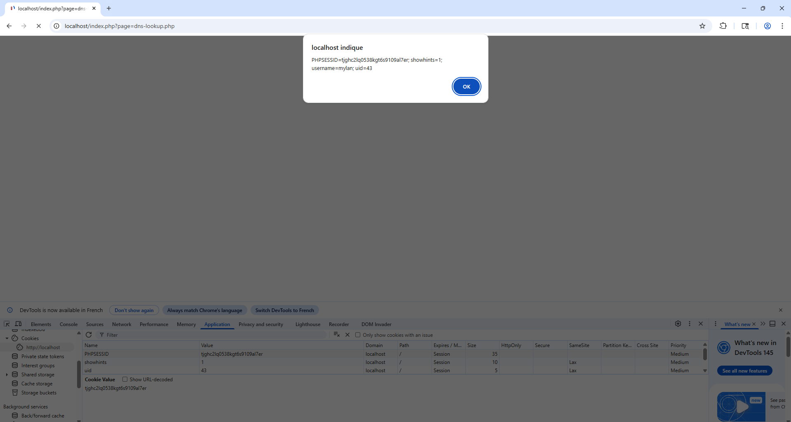
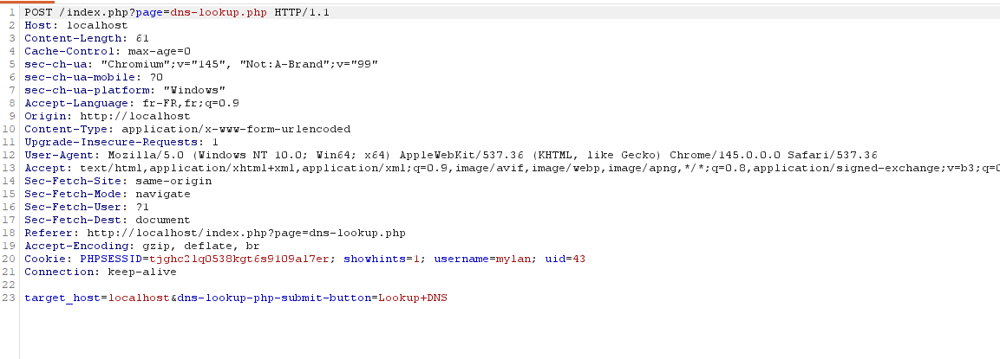
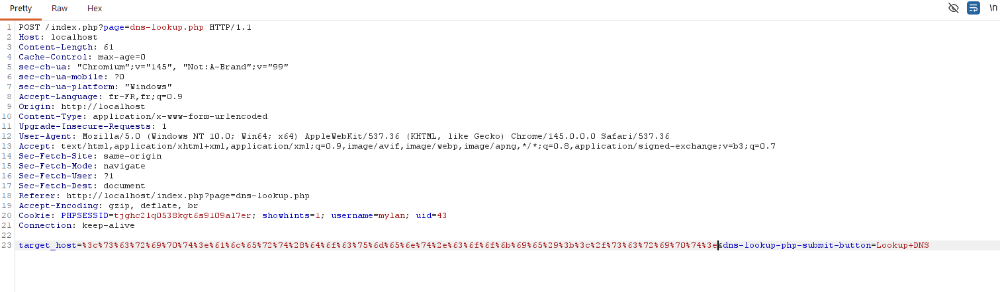
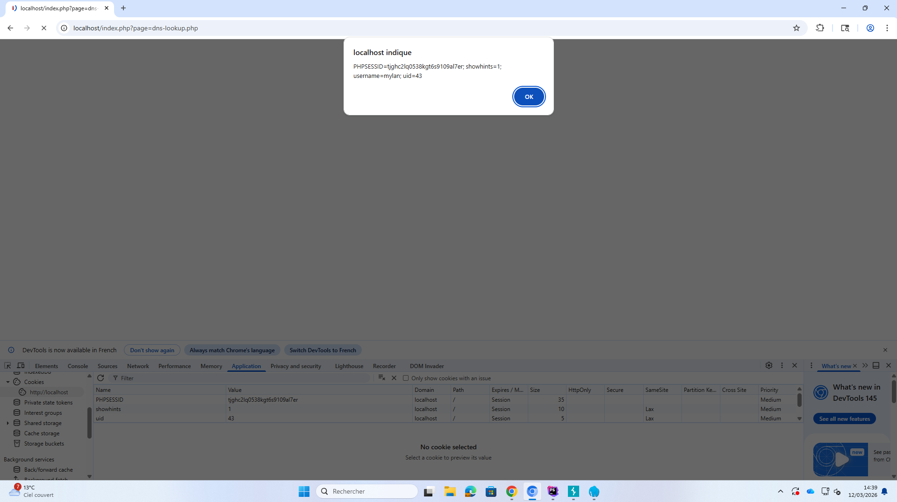
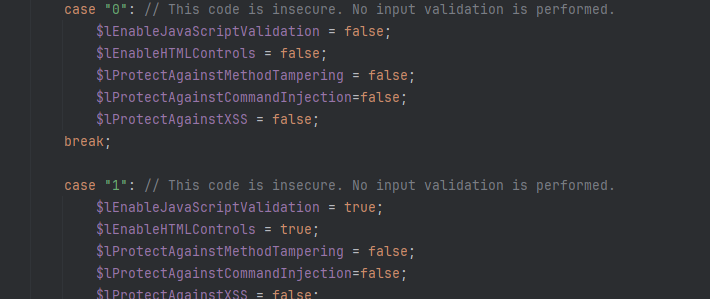
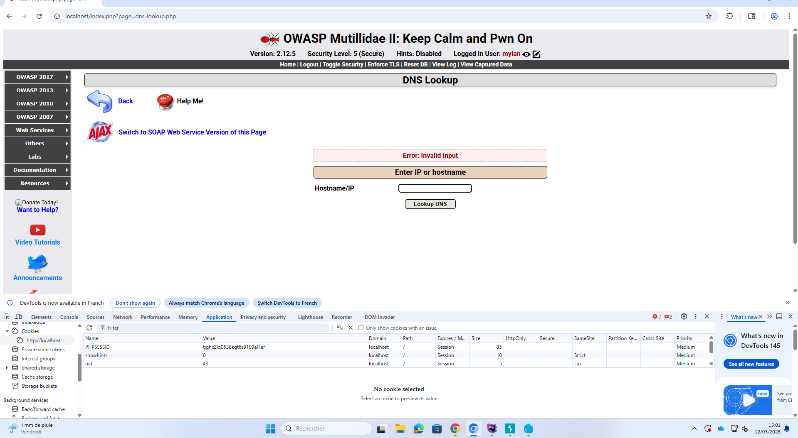
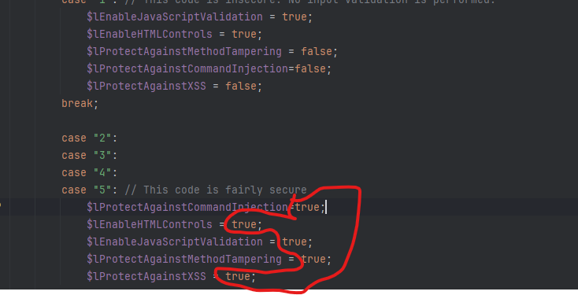
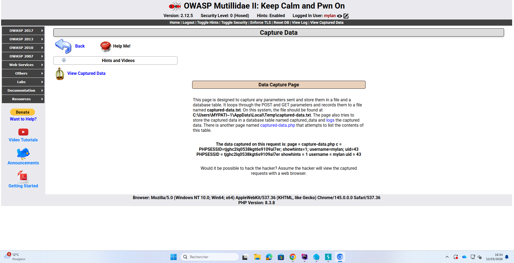

= TpXSS Compte rendu

== Premier défi
=== Niveau de sécurité 0

C'est la commande qu'on a encoder en URL puis placer à la place de localhost ""

== Niveau de sécurité 1

Au niveau du code, on ne remarque aucune différence avec le niveau de sécurité 1

Est-il possible d’écrire le code malicieux directement dans le formulaire ?

Oui, il est possible d'écrire directement dans le formulaire

*Est-ce que le niveau de sécurité 1 permet d’éviter l’attaque avec Burpsuite ?*

Non le niveau 1 ne permet pas d'éviter l'attaque avec Burpsuite

On voit deux false passer en true au niveau du code source entre le case"0" et le case"1". Ce sont les deux premières qui désactive du code purement naïf

*Quels sont les caractères typiques utilisés lors d’une attaque XSS ?*
Ce sont les "<,>"pour démarrer un début de script, le "=" pour assigner des valeurs à un attribut, le"&" pour un encodage html et "/" pour fermer une balise comme script

== Niveau de Sécurité 5

*Est-ce que le niveau de sécurité 5 permet d’éviter l’attaque avec BurpSuite ?*

Oui le niveau de sécurité 5 permet d'éviter l'attaque surement grâce à un control très sécurisé de la saisie d'où l'erreur "Invalid Input"

*En observant le fichier dns-lookup.php, repérer les variables spécifiques associées à ce niveau de protection.*

*Expliquer le rôle de l’instruction suivante dans le fichier dns-lookup.php (ligne n° 44) :*

Le rôle de cette instruction est qu'elle est un "raccourcis" des conditions (if/else), elle vérifie donc si la protection est activé, si elle l'es on prend la valeur envoyé uniquement grâce à la méthode POST et si elle est fausse (_REQUEST) la valeur peut provenir des différentes méthodes , Cookies également et donc on prend possiblement de fausse valeur.

*Que vérifie la protection contre les injections de commandes ?*

Elle vérifie que l'utilisateur est valide(que l'IP a 4 octet,que l'IPv6 correspond au modèle donné et que le nom de domaine est au format IANA)

*Quelle fonction permet d’éviter spécifiquement les attaques de type XSS ?*

C'est la fonction $lProtectAgainstXSS qui est passer en true dans le niveau de protection 5

*Résumer les protections mises en œuvre par le niveau de protection n°5.*

On a 5 protections mise en oeuvre par le niveau5 :

- $lProtectAgainstCommandInjection : Vérifie la véracite de l'utilisateur si tout concorde avec les conditions mis

- $lEnableHTMLControls : qui permet de contrôler l'HTML , par exemple certains champs dans des balises seront limités.

- $lEnableJavaScriptValidation : cela va "valider" le code javascript avant de l'envoyer au navigateur

- $lProtectAgainstMethodTampering :  ça empêche la manipulation des méthodes en HTML (GET,POST...) ça permettra qu'elle reçoive seulement la méthode attendu

- $lProtectAgainstXSS : elle protège contre les injections XSS

== Deuxième défi
=== Niveau de Sécurité 0

