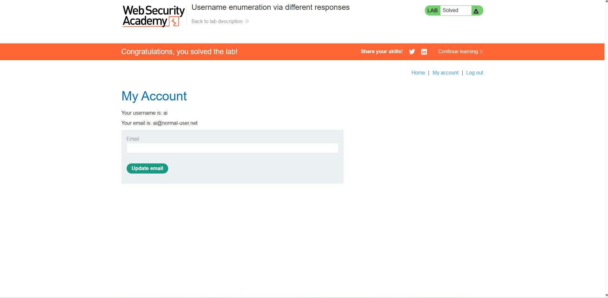

= TP4 Compte rendu

== Lab manipultation de cookie

image::images/reussi1.png[]

==== Q1 Pourquoi est-il dangereux de stocker un paramètre comme Admin=false directement dans un cookie, même si l’utilisateur ne peut pas le voir à l’écran ?
*C'est facilement modifialble*

== Lab Emuneration de login

=== Q3
*Ce qui m'a permis de distinguer le bon login du mauvais et le la longueur(lenght) des différents login présents dans le dictionnaire, pour ma part ils étaient tous à 3248 à part un seul qui lui avait une longueur de 3250.*

=== Q4
*C'est de hasher le login et mdp et d'installer un salt dans le code , détruisant ainsi la possibilité d'utiliser des logins provenant de rainbow table*

