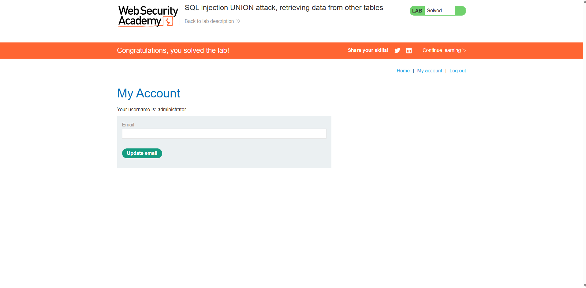

= TP5 Compte rendu

== Lab2.1 Voir ce qu’on ne devrait pas voir

image::images/labo1.png[]

=== Q1. Dans le Lab 1, pourquoi l’ajout de OR 1=1 permet-il d’afficher des données qui étaient censées être cachées ? Expliquez la logique booléenne.
Car l'ajout de OR 1=1 dit que la conditions sera toujours VRAI , le 1=1 est une condition VRAI car 1 = toujours à 1.

== 2.2. Lab 2 : Contournement d’Authentification

image::images/labo2.png[]

=== Q2. Dans le Lab 2, quel est le rôle précis des caractères -- (ou # selon la base de données) à la fin de votre injection ? Pourquoi cela permet-il de se passer du mot de passe ?
Le rôle de ses caractères est de définir le reste de la ligne de code en commentaire,donc deviendra invisible lors de l'éxécution et enlevera toute autre condition

== 2.3. Lab 3 : Préparer l’extraction (UNION Attack 1)

image::images/labo3.png[]

=== Q3. Dans le Lab 3 (UNION), pourquoi est-il obligatoire de connaître le nombre exact de colonnes avant de pouvoir extraire des données ? Que se passe-t-il si les deux requêtes n’ont pas la même structure ?

Car l'opérateur UNION exige d'avoir le meme nombre de colonne pour les deux requetes sinon elle retourne une erreur

== 2.4. Lab 4 : Le Braquage de données (UNION Attack 2)

=== Q4. Quelle est la meilleure méthode de protection (côté code PHP/Java/C#) pour empêcher totalement les injections SQL, rendant les caractères comme ' ou OR inefficaces ?
C'est l'utilisation de requête préparer paramétrer, qui permettra l'annulation de toute tentative d'injection SQL

== 2.5. Lab 5 : L’Injection en Aveugle (Blind SQLi)

=== Q5. Dans une injection SQL "Blind" (Aveugle), l’attaquant ne voit jamais les données s’afficher à l’écran. Comment fait-il alors pour voler un mot de passe entier ? Pourquoi cette technique est-elle beaucoup plus lente qu’une injection UNION classique ?

Pour voler un mot de passe en entier il peut se baser sur le temp de réponse du serveur par rapport à chaque lettre puis reconstituer le MDP avec les temps de réponses obtenus.

*Exemple* : admin' AND IF(substring(database(),1,1)='a', sleep(2), 0) # (L'attaquant demande a la base de données si la première lettre est 'a' si c'est 'a' il répondra deux secondes plus tard, sinon instantanément )

Cette technique est plus lente car si un voyant fait la course contre un aveugle , l'aveugle sera forcément désavantager. Pour une injection à l'aveugle on ne reçoit rien et on ne peut se baser sur rien à part de faire "dormir" ou "courir" le serveur en cas de bonne réponse , ce qui est plus long à preparer.