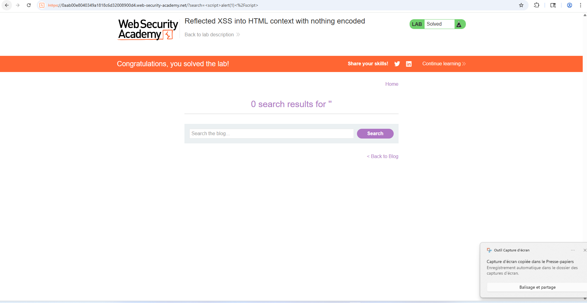
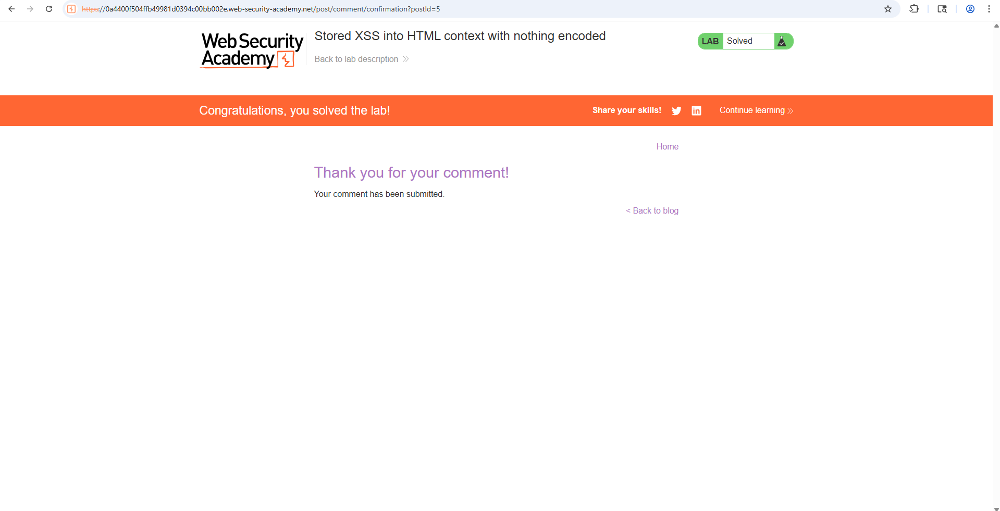
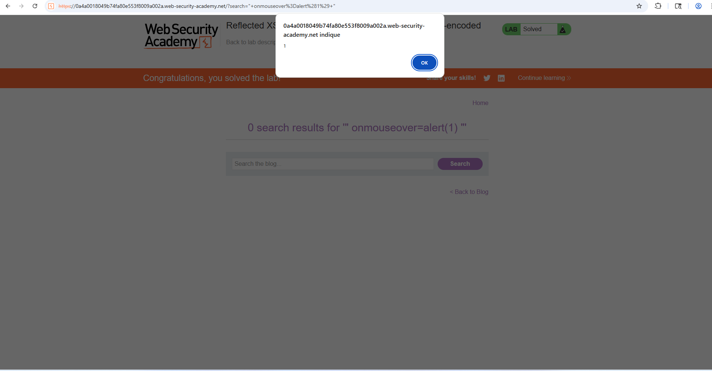
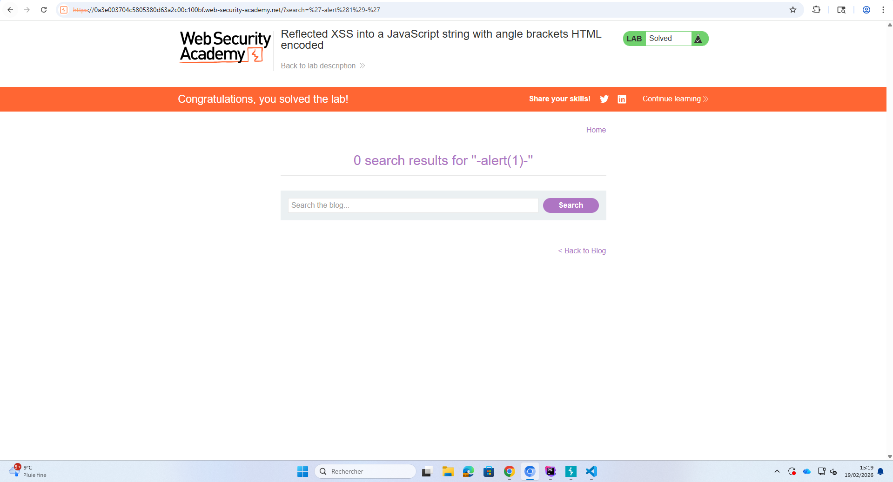
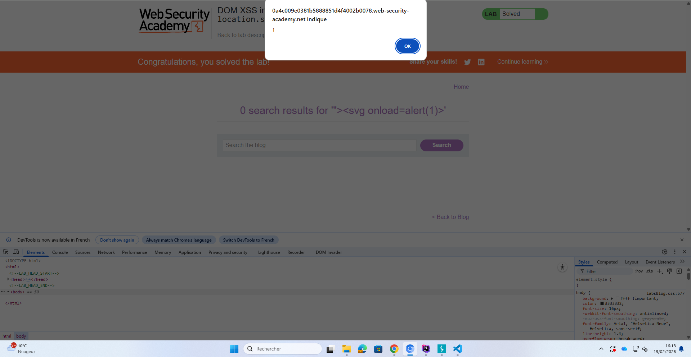

= TP6 compte rendu

== 2.1. Lab 1 : Le Classique (Reflected XSS)

== 2.2. Lab 2 : Le Piège à retardement (Stored XSS)

=== 3.1. Q1. Différence Stored vs Reflected

La différence majeur en terme de dangerosité est que le Stored Xss stocke le code malveillant en base de données ce qui la fait durer dans le temps. Alors que pour le Reflected l'attaquant passe par un lien pour que le code s'exécute instantanément.

Pour ne pas éveiller les soupçons la méthode la plus efficace est le stored XSS car c'est la plus dangereuse des deux qui est ENREGISTRER dans le serveur et l'admin pourrait meme être pieger car à la visite du site il sera infecter.

== 2.3. Lab 3 : Sortir de la case (XSS dans un attribut)

=== 3.2. Q2. Le contexte d’attribut (Lab 3)

L'injection classique ne fonctionne pas car l'injection est attraper par le navigateur en utilisant "< , >" ce qui en HTML créer une nouvelle balise et qui donc désactive le script. Elle est  passé en simple texte, plus considérer comme la balise "primaire" de la ligne.

== 2.4. Lab 4 : Casser le JavaScript (XSS dans un script)

=== 3.3. Q3. Syntaxe JavaScript (Lab 4)
' sert à fermer les chaînes de caractères , (;) sert à fermer l'instruction de la ligne car dans la plupart des Langages de Programmation elle est utiliser à la fin de l'instruction et (//) sert à mettre le reste en commentaire.

== 2.5. Lab 5 : Le DOM XSS (Client-Side)

=== 3.4. Q4. DOM XSS (Lab 5)

Car une faille DOM XSS s'éxécute dans le navigateur WEB directement contrairement à une faille Reeflected XSS qui elle s'éxécute sur le serveur donc à l'endroit où est situer le WAF.

=== 3.5. Q5. Remédiation

Encoder (échapper) toutes les données affichées à l’écran (ex: < devient <).
