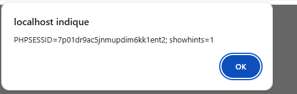
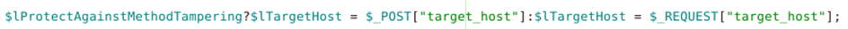

Question 1::
Est-ce que le niveau de sécurité 1 permet d’éviter l’attaque avec Burpsuite ?

NON Le "Niveau 1" (généralement en référence aux niveaux de difficulté de plateformes comme DVWA ou à des configurations de sécurité basiques) n'est pas une barrière magique contre un outil comme Burp Suite.

Question 2 ::
Est-il possible d’écrire le code malicieux directement dans le formulaire ?

Il est en effet possible de tenter d'injecter du code directement dans un formulaire si celui-ci n'est pas correctement sécurisé. C'est le principe de base de plusieurs types d'attaques informatiques.

Question 3 ::
En observant le code de la page dns-lookup.php, repérer les sécurités activées à ce niveau ?

Pour identifier les sécurités activées dans un script comme dns-lookup.php (souvent utilisé dans des exercices de cybersécurité ou des outils réseau), il faut examiner comment les entrées utilisateur sont traitées avant d'être passées au système.

Question 4::
Quels sont les caractères typiques utilisés lors d’une attaque XSS ?

Lors d'une attaque XSS (Cross-Site Scripting), l'objectif du pirate est d'injecter un script malveillant (généralement du JavaScript) dans une page web pour qu'il soit exécuté par le navigateur de la victime.

== Test Niveau 5

Question 5::

Est-ce que le niveau de sécurité 5 permet d’éviter l’attaque avec BurpSuite ?

NON Aucun "niveau de sécurité" (que ce soit dans un outil d'apprentissage comme DVWA ou une configuration d'entreprise) n'empêche l'utilisation de Burp Suite en soi.

Question 6::
Pour identifier les variables spécifiques dans un fichier dns-lookup.php (généralement utilisé dans des exercices de cybersécurité comme DVWA ou des environnements de test), il faut isoler celles qui capturent l'entrée utilisateur et celles qui traitent la commande système ?

C'est une excellente approche. Dans des environnements comme DVWA (Damn Vulnerable Web Application), le fichier dns-lookup.php est le cas d'école parfait pour comprendre les vulnérabilités d'injection de commande (Command Injection).

Question 7::

Expliquer le rôle de l’instruction suivante dans le fichier dns-lookup.php (ligne n° 44) :

D'après la structure classique du script dns-lookup.php (généralement utilisé dans des exercices de sécurité web ou d'administration réseau), la ligne n°44 correspond souvent à l'exécution d'une commande système pour interroger un serveur DNS.

Question 8::
Que vérifie la protection contre les injections de commandes ?

La protection contre les injections de commandes (ou OS Command Injection) est un rempart de sécurité essentiel. Son rôle est d'empêcher un attaquant d'exécuter des commandes système arbitraires sur le serveur qui héberge l'application.

Question 9::

Quelle fonction permet d’éviter spécifiquement les attaques de type XSS ?

Il n'existe pas une seule fonction magique universelle, car la protection dépend de l'endroit où vous affichez les données (HTML, JavaScript, attributs, etc.). Cependant, la règle d'or est l'échappement (escaping) ou le nettoyage (sanitization).

Question 10 ::

