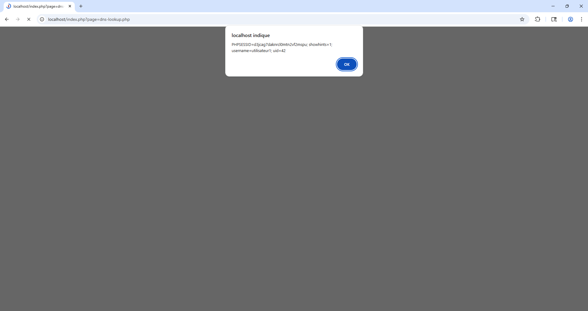

= Compte Rendu de TP : Sécurité Web (XSS)
:author: Philopatir Wardi Romani
:toc: left
:icons: font

=== Screenshots

== 1. Test du niveau 1 de sécurité :
---

=== 1.1. Est-ce que le niveau de sécurité 1 permet d’éviter l’attaque avec Burpsuite ?
*Non, le niveau 1 ne bloque pas l'attaque via Burp Suite.*
La sécurité de niveau 1 est située "côté client" (en JavaScript dans le navigateur). Comme Burp Suite intercepte la requête **après** le passage par le navigateur, on peut injecter le script directement dans le proxy. Le serveur reçoit alors le code malveillant sans aucune vérification.

=== 1.2. Est-il possible d’écrire le code malicieux directement dans le formulaire ?
*En général, non.*
Le formulaire possède souvent des attributs HTML (comme `pattern`) ou des scripts de validation qui empêchent de taper des caractères spéciaux comme `<` ou `>`. L'utilisation d'un proxy comme Burp Suite est donc nécessaire pour contourner ces barrières visuelles.

=== 1.3. En observant le code de la page dns-lookup.php, repérer les sécurités activées à ce niveau.
Au niveau 1, on remarque :
* Une absence de nettoyage des données côté serveur.
* L'absence de la fonction PHP `htmlspecialchars()`, ce qui permet au navigateur d'interpréter le texte saisi comme du code HTML/JavaScript.

=== 1.4. Quels sont les caractères typiques utilisés lors d’une attaque XSS ?
Les caractères les plus utilisés sont :
* `<` et `>` : Pour ouvrir et fermer les balises (ex: `<script>`).
* `"` et `'` : Pour sortir d'un attribut HTML existant.
* `(` et `)` : Pour exécuter des fonctions JavaScript (ex: `alert()`).
* `;` : Pour séparer les instructions de code.

== 2. Test du niveau 5 de sécurité :
---

=== 2.1. Est-ce que le niveau de sécurité 5 permet d’éviter l’attaque avec BurpSuite ?
*Oui, l'attaque échoue au niveau 5.*
Même en utilisant Burp Suite pour forcer l'envoi du script, le serveur possède une sécurité robuste qui neutralise le code avant de l'enregistrer ou de l'afficher. Le script s'affiche sous forme de texte brut et ne s'exécute jamais.

=== 2.2 En observant le fichier dns-lookup.php, repérer les variables spécifiques associées à ce niveau de protection.
Les variables principales utilisées pour la sécurité au niveau 5 sont :
* `$lTargetHost` : Elle contient l'adresse saisie après avoir été nettoyée par le serveur.
* `$lSecurityLevel` : Elle permet au script de savoir que la sécurité est au maximum (niveau 5) pour appliquer les filtres les plus stricts.

=== 2.3 Expliquer le rôle de l’instruction suivante dans le fichier dns-lookup.php (ligne n° 44) :
L'instruction à la ligne 44 sert à **valider le format de la donnée**. Elle vérifie que ce que l'utilisateur a envoyé est bien une adresse IP ou un nom de domaine valide. Si la donnée contient des caractères bizarres (comme `<script>`), l'instruction rejette la demande pour protéger le serveur.

=== 2.4 Que vérifie la protection contre les injections de commandes ?
Elle vérifie que l'utilisateur n'essaie pas d'ajouter des commandes système supplémentaires. Elle traque les caractères "spéciaux" comme `&`, `&&`, `|` ou `;` qui permettraient à un attaquant d'exécuter des ordres cachés sur le serveur (comme effacer des fichiers) en plus de la simple recherche DNS.

=== 2.5 Quelle fonction permet d’éviter spécifiquement les attaques de type XSS ?
La fonction spécifique est **`htmlspecialchars()`**. Elle transforme les caractères HTML dangereux (comme `<` et `>`) en texte inoffensif. Ainsi, le navigateur affiche le code à l'écran au lieu de l'exécuter comme un script.

=== 2.6 Modifier le code source de la page dns-lookup.php afin d’isoler l’effet de cette protection.
Pour isoler la protection XSS et voir son effet, on peut commenter la partie qui vérifie le format (la validation) pour ne laisser que l'encodage à l'affichage :

[source,php]
----

// if ($lValidationManager->isInputValid($lTargetHost)) {

// On garde seulement la protection contre l'affichage (XSS)
echo "Résultat pour : " . htmlspecialchars($lTargetHost);

// }
----

=== 2.7 Résumer les protections mises en œuvre par le niveau de protection n°5.
Le niveau 5 utilise une sécurité multi-couches :
1. **Validation stricte :** On n'accepte que les lettres, chiffres et points.
2. **Filtrage des commandes :** Blocage des symboles permettant d'ajouter des ordres.
3. **Encodage de sortie :** Utilisation de `htmlspecialchars` pour empecher le XSS.

== 7. Deuxième défi : XSS permanent (Logs)

=== 1.1 L’attaque réussit-elle avec le niveau de sécurité 5 ?
*Non.* Le serveur bloque l'attaque. Le code est transformé en simple texte avant d'être affiché. Le script ne peut pas se lancer.

=== 1.2 Pourquoi la validation en entrée (input validation) n’est pas suffisante ?
La validation à l'entrée ne suffit pas car :
 Un attaquant peut contourner les filtres avec des codes complexes.
 Une donnée peut être "propre" pour la base de données mais devenir un "virus" si elle n'est pas protégée au moment de l'affichage sur la page.

=== 1.3 Expliquer le rôle des options de sécurité activées au niveau 5.
Elles servent à :
 **Neutraliser :** Transformer les balises `<script>` en texte inoffensif.
 **Protéger :** Empêcher le navigateur de lire la donnée comme un ordre à exécuter.
 **Sécuriser :** Éviter que le pirate ne piège les autres utilisateurs qui lisent les logs.

=== 1.4 Rechercher sur internet d’autres exemples d’encodage associés à d’autres langages.
* **Java :** Utilise `<c:out />`.
* **JavaScript :** Utilise `.textContent` (au lieu de `.innerHTML`).
* **Python :** Utilise le filtre `| e`.
* **ASP.NET :** Utilise `HtmlEncode()`.

=== 1.5 Conclure sur les bonnes pratiques en matière de protection contre le XSS.
1. **Protéger l'affichage :** Utiliser `htmlspecialchars()` en PHP.
2. **Vérifier sur le serveur :** Ne jamais faire confiance à l'utilisateur.
3. **Autoriser le minimum :** N'accepter que les lettres et les chiffres.

Compte rendu de Philopatir Wardi Romani SIO1