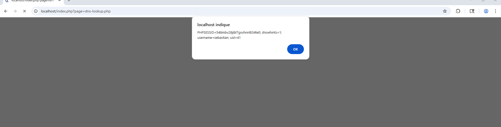
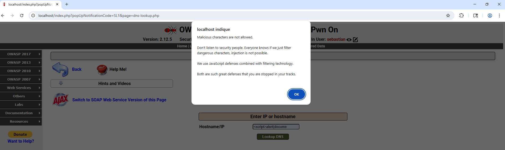
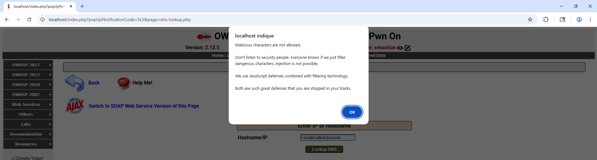
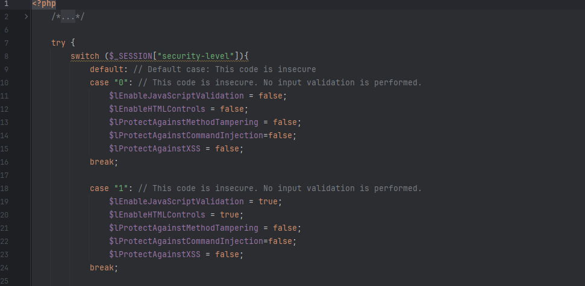
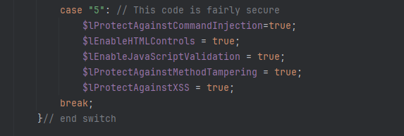
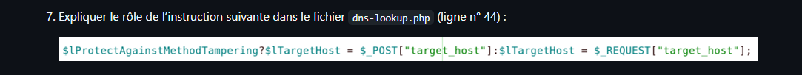
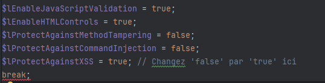
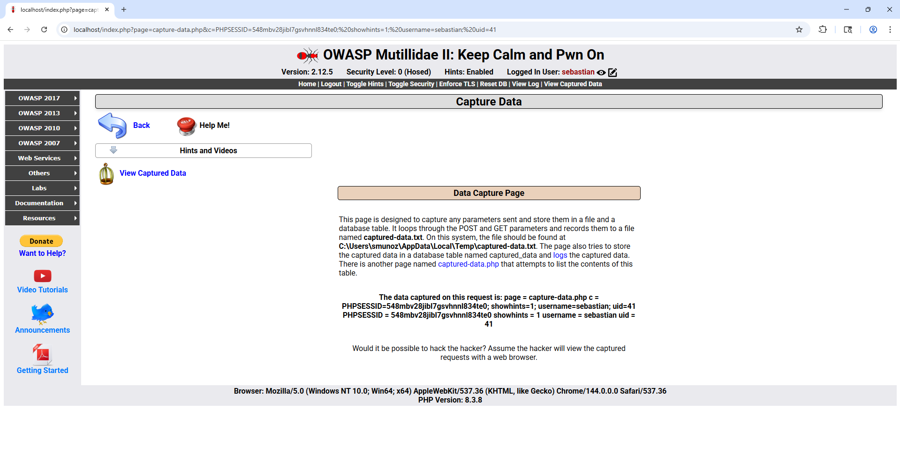

= Défi N°1

##niveau 0:
##

##niveau 1:
##

##niveau 5:
##

##QUESTIONS:
##

#(Q1) ce que le niveau de sécurité 1 permet d’éviter l’attaque avec Burpsuite ?#

reponse:

OUI, le niçveau 1 detecte des caracteres malveillent  et lance une alert .

##(Q2) Est-il possible d’écrire le code malicieux directement dans le formulaire ?
##

reponse:

cela depend du niveau au quelle notre cite multidilae est-t-il configuré, deplus pour ecrire un code malicieux tout d'abord on doit ecrire un code java script qui contient le code malveillent.

##(Q3) En observant le code de la page dns-lookup.php, repérer les sécurités activées à ce niveau.
##

reponse:

Au niveau "1", seules les validations côté client (JavaScript et contrôles HTML) sont activées, tandis que les protections serveur contre l'injection de commande, l'XSS et la manipulation de méthode restent désactivées.

##(Q4) Quels sont les caractères typiques utilisés lors d’une attaque XSS ?
##

reponse:

Les caractères essentiels d'une attaque XSS sont **`< > " ' /`**, car ils permettent de forger des balises HTML (comme `<script>`) ou de manipuler des attributs JavaScript.

Deplus on utilise également **`( ) ; =`** pour exécuter des fonctions et structurer le code injecté.

##(Q5)  Est-ce que le niveau de sécurité 5 permet d’éviter l’attaque avec BurpSuite ?
##

reponse:

OUI, Le niveau 5 bloque l'attaque via le navigateur

##(Q6) En observant le fichier dns-lookup.php, repérer les variables spécifiques associées à ce niveau de protection.
##

reponse:

##(Q7) Expliquer le rôle de l’instruction suivante dans le fichier dns-lookup.php (ligne n° 44) :
##

reponse:

Cette ligne utilise un opérateur ternaire pour restreindre la source des données : si la protection est active, elle force l'usage de $_POST (plus sûr) ; sinon, elle accepte $_REQUEST (permissif), autorisant ainsi l'envoi de paramètres via l'URL ou les cookies.

##(Q8) Que vérifie la protection contre les injections de commandes ?
##

reponse:

La protection contre les injections de commandes vérifie que la saisie correspond strictement au format attendu d'une **adresse IPv4, IPv6 ou d'un nom de domaine valide** via des expressions régulières (Regex).

Elle empêche ainsi l'utilisation de caractères de chaînage (comme `;`, `&&` ou `|`) qui permettraient d'exécuter des commandes système arbitraires sur le serveur.

##(Q9) Quelle fonction permet d’éviter spécifiquement les attaques de type XSS ?
##

reponse:

La fonction qui permet d'éviter les attaques XSS dans ce code est **`$Encoder->encodeForHTML()`**.

Elle convertit les caractères spéciaux (comme `<` ou `>`) en entités HTML, empêchant ainsi le navigateur de les interpréter comme du code exécutable.

##(Q10 )Modifier le code source de la page dns-lookup.php afin d’isoler l’effet de cette protection.
##

reponse:

modification:

Dans cette modification même si le niveau est configuré sur "1", le serveur appliquera désormais la fonction `$Encoder->encodeForHTML()` sur la saisie.
Les balises comme <script> seront affichées sous forme de texte brut à l'écran au lieu d'être exécutées par le navigateur.

##(Q11) Résumer les protections mises en œuvre par le niveau de protection n°5.
##

reponse:

Le niveau 5 assure une sécurité maximale en activant la validation serveur par Regex (contre les injections de commandes), l'encodage des caractères (contre le XSS) et la restriction stricte à la méthode POST (contre la manipulation de paramètres), tout en maintenant les contrôles JavaScript et HTML côté client.

= Défi N°2

##(Q1) L’attaque réussit-elle avec le niveau de sécurité 5 ?
##

reponse: Non , l'attaquent n'arrive pas avec le niveau de securité 5

##(Q2) Ouvrir la page show-log.php et relever les options activées au niveau de sécurité 5.Expliquer pourquoi la validation des données saisies en entrée (input validation) n’est pas suffisante comme mesure de sécurité.
##

reponse:

Au niveau de sécurité 5 de la page show-log.php, les options activées sont l'encodage systématique des sorties ($lEncodeOutput = true) pour neutraliser le XSS et la limitation du nombre d'enregistrements affichés ($lLimitOutput = true) pour prévenir les dénis de service (DoS) par saturation de journaux.

La validation des entrées (input validation) est insuffisante car elle ne peut pas anticiper tous les contextes d'affichage futurs, et certaines données légitimes (comme des caractères spéciaux dans un mot de passe ou une signature) doivent être acceptées tout en restant dangereuses si elles sont affichées sans précaution. C'est l'encodage en sortie qui garantit que, peu importe la dangerosité de la donnée stockée, elle sera traitée comme du simple texte et non comme du code par le navigateur.

##(Q3) Expliquer le rôle des options de sécurité activées au niveau 5.
##

reponse:

rôles des deux protections du niveau 5 :

*$lEncodeOutput (Encodage HTML) :* Neutralise les attaques XSS en transformant les caractères spéciaux en texte inerte, empêchant le navigateur d'exécuter des scripts malveillants stockés dans les logs.

*$lLimitOutput (Limitation DoS) :* Prévient le Déni de Service en limitant l'affichage aux 20 derniers enregistrements, évitant ainsi le plantage du serveur ou du navigateur par une surcharge de données.

##(Q4) Rechercher sur internet d’autres exemples d’encodage associés à d’autres langages de programmation.
##

reponse:

Exemples d'encodage selon le langage :

_**Java **_: utilise Encode.forHtml() de la bibliothèque OWASP pour neutraliser les balises malveillantes.

*__Python __*: utilise html.escape() pour convertir les caractères spéciaux en texte inerte.

En résumé, chaque langage dispose de fonctions dédiées pour transformer les données à risque en texte sécurisé avant leur affichage.

##(Q5) Conclure sur les bonnes pratiques en matière de protection contre le XSS.
##

reponse:

Pour conclure, la protection contre le XSS repose sur deux piliers essentiels :

L'encodage systématique en sortie : C'est la règle d'or ; il faut convertir les caractères spéciaux en entités HTML `(ex: < en  &lt ;)` selon le contexte d'affichage pour neutraliser tout script.

La défense en profondeur : Il faut cumuler la validation des entrées côté serveur, l'utilisation de politiques de sécurité de contenu (CSP) et l'activation de drapeaux de sécurité comme HttpOnly sur les cookies.

