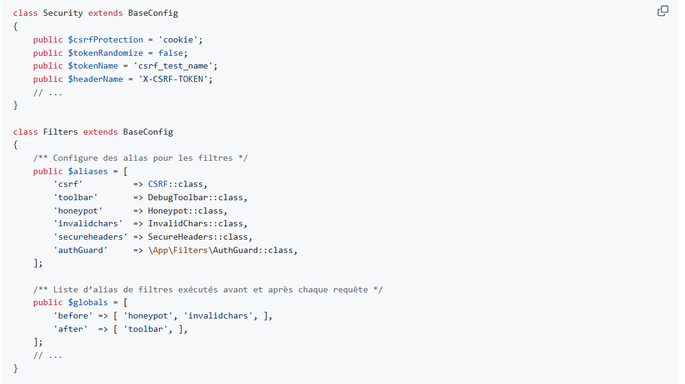

= Etude de cas CSRF Compte rendu

== Question C.3 :

Indiquer pour chacune des deux solutions de protection contre les attaques CSRF proposées par l’environnement de développement CodeIgniter les *éléments de sécurisation stockés côté client et ceux stockés côté serveur.*

La solution par défaut dans l'environnement de développement CodeIgniter est la solution `double submit cookie`, comme indiquer dans le nom "double", elle va créer un jeton *CSRF* envoyé sous deux formes différentes : un envoyé sous forme de cookie dans la session de l'utilisateur et l'autre directement dans le formulaire HTML on a donc aucun stockage côté serveur tout est vers le client.

L'autre solution est `Synchronizer Token Pattern` cette fois ci on aura du stockage côté serveur, le token *CSRF* est envoyé en SESSION côté serveur puis le serveur l'envoie au client dans un champs caché du formulaire ou dans l'URL, le serveur connaît donc la valeur du cookie car il est stocké côté serveur.

*Indiquer les modifications à apporter aux classes Security et Filters afin d’activer la protection CSRF basée sur la session (Synchronizer token) et préciser ce que les développeurs des vues devront utiliser dans les formulaires qu’ils veulent protéger.*

A la classe Security il faut appliquer la modification suivante :

Remplacer la valeur de la proprieter public `$csrfProtection = 'cookie'` par `$csrfProtection = 'session'`

Et pour activer la protection csrf il suffit de rajouter dans le tableau `public $globals` , dans le tableau before 'csrf', avant 'honeypot'.

Pour protéger les formulaires les devs de vues devront utiliser les filtres csrf,invalidChars,honeypot,secureHeaders , tout les filtres présenter aucun ne sert à rien c'est bien pour ça qu'ils sont la.

== Question C.4 :

*Expliquer pourquoi les routes de l’interface API ne répondent plus depuis la mise en place de la protection contre les attaques CSRF.*

Car une API ne renvoie rien permettant à la protection csrf de laisser passer la requête, avec la protection csrf on attent un token, un cookie valide pour laisser passer la requête or une API ne fonctionne pas avec se système ce qui crée un conflit.

*Indiquer les modifications à apporter à la classe Filters afin de mettre en place une liste blanche en vous aidant du fichier de configuration des routes.*

`'csrf' => ['except' => ['ws/*']]` c'est le code qu'il faut ajouter dans le tableau `public $globals` , donc dans le before , l'étoile signifiant "TOUT" toutes les routes commençant par ws seront épargner du filtre csrf.

