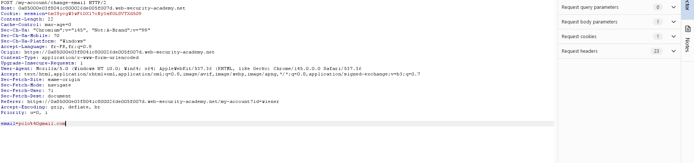
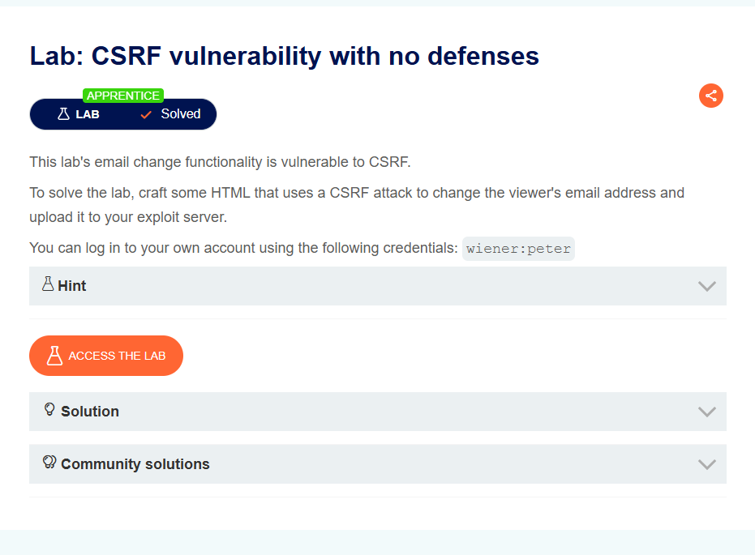

= TpCSRF Compte rendu

== Questions de Synthèse

1. **Architecture :** Expliquez avec vos propres mots pourquoi l'attaque CSRF du Lab 1 ne fonctionnerait pas si la victime s'était déconnectée du site cible juste avant de visiter la page malveillante de l'attaquant ?

Car on a besoin d'une valeur dans "email" et une victime déconnecté n'a pas de compte,pas de cookie de session prouvant qu'il est connecter et n'a aucune "identité" qu'on peut usurper, donc considérer comme anonyme.

